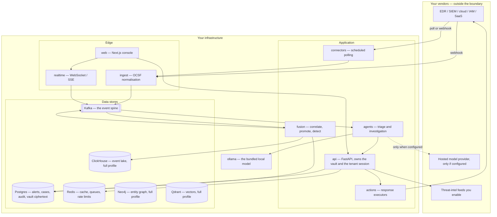
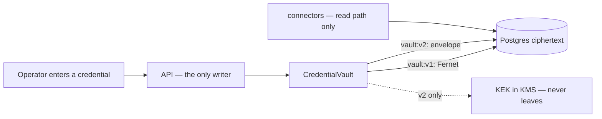

# Architecture and data flow

What the components are, where the trust boundaries fall, and where each class
of data goes. The two STRIDE models
([platform](platform-threat-model.md), [agent](agent-threat-model.md)) analyse
the threats; this page is the map they analyse.

Every component named below is a directory in this repository or a service in
[`docker-compose.yml`](../../docker-compose.yml). The service counts are not
prose — `scripts/check_profile_service_counts.py` fails when a published
figure disagrees with the compose file, and it reports **core 16, full 22**.

## Deployment topology

Six of these are optional: `clickhouse`, `neo4j`, `opensearch`, `ueba`,
`honeytokens` and `purple-team` carry a compose `profiles:` key and do not
start under `make up`. The lake, the graph and the vector store are therefore
absent on a default install, and so is any data in them.

## Trust boundaries, and what crosses each

| Boundary | Crosses it | Control | Where |
|---|---|---|---|
| Browser → API | A session JWT or an API key | One authentication funnel resolves every credential type and records the verified principal | [`deps.py::get_current_user`](../../services/api/app/api/v1/deps.py) |
| Vendor → ingest | Attacker-influenceable telemetry | Authenticated ingest; OCSF normalisation; schema validation with poison events to a dead-letter queue | [`services/ingest`](../../services/ingest), [`dlq.py`](../../services/fusion/app/services/dlq.py) |
| Telemetry → model prompt | Attacker-influenceable strings | Per-run nonce evidence fence, injection guard, structured-output re-validation | [agent threat model](agent-threat-model.md) |
| Model → tool call | A verdict and a proposed action | Capability contract, confidence × impact approval matrix, autonomy tier | [`services/actions`](../../services/actions) |
| Service → service | A shared service token | The token, **plus** the tenant as a header verified against the `tenants` table; a service naming no tenant is refused | [`deps.py`](../../services/api/app/api/v1/deps.py) |
| Tenant → tenant | Nothing, by design | Row-level security on Postgres plus query-layer predicates; a per-store scope for each of the other five | [below](#tenant-isolation-per-store) |
| API → vendor | A decrypted connector credential | Vault decryption at point of use; least-privilege scopes | [`credential_vault.py`](../../services/api/app/security/credential_vault.py), [least privilege](connector-least-privilege.md) |

## The event path, end to end

A single event's journey, and what is written where:

1. **Arrival.** A connector polls a vendor on a schedule, or the vendor posts
   to an ingest webhook. Credentials for the poll are decrypted from the vault
   at that moment.
2. **Normalisation.** `services/ingest` maps the vendor payload to OCSF and
   stamps the tenant. The vendor's original payload is preserved under
   `raw_event`.
3. **The spine.** The normalised event is produced to Kafka. The tenant
   travels in the envelope.
4. **Fusion.** `services/fusion` archives to the lake if the lake is running,
   evaluates the detection corpus, and promotes what qualifies into an alert
   row in Postgres. Correlation groups alerts into incidents.
5. **Triage.** `services/agents` consumes fused alerts and triages each one.
   This is the only step that can involve a model, and
   [what reaches the model depends on the mode](data-handling.md).
6. **Response.** Any action is a capability with a declared risk,
   reversibility and approval tier. The default posture requires a human.
7. **Record.** Every agent decision is appended to the Investigation Ledger,
   and every mutating API call to a hash-chained audit log.

## Tenant isolation, per store

Postgres row-level security covers one of six stores, so each of the other
five needed its own answer. The suite that holds them is
[`tests/isolation/`](../../tests/isolation/), in two layers: an offline half
asserting each read path *constructs* a scope, and a live half that seeds two
tenants into real containers and asserts a read as A returns zero B rows.

| Store | Scope | Gate |
|---|---|---|
| Postgres | Row-level security (133 `CREATE POLICY` statements) **and** query-layer `tenant_id` predicates | `scripts/check_tenant_query_predicates.py`, `isolation-live.yml` |
| ClickHouse | `lake_sql.rewrite_for_tenant` injects the predicate and **fails closed** if it does not survive rendering | `lake-isolation.yml` |
| Neo4j | A `tenant_id` property filter on every node of every path | `isolation-live.yml` |
| Redis | A `tenant:{id}:` key prefix | `isolation-live.yml` |
| Kafka | The tenant in the envelope, filtered downstream | `isolation-live.yml` |
| Qdrant | `tenant_id` in the point payload plus a mandatory query filter | `isolation.yml` |

Two limits worth stating. **Row-level security only binds a role that does not
bypass it** — the services connect as a DML-only `aisoc_app` role rather than
the owner, and `scripts/check_runtime_db_role.py` holds that. And **public
feed intelligence is deliberately global**: scoping targets tenant-private
data, not a CISA KEV entry every tenant should see.

## Where credentials live

Connector credentials are the top asset, because compromising AiSOC
compromises everything it connects to.

The API service holds the encrypt/decrypt authority. `services/connectors`
ships a vendored read-path `decrypt_dict()` so the poll scheduler can decrypt
without owning the write path, and those vendored copies must **refuse** a
`vault:v2:` token rather than hand ciphertext onward as if it were a
credential.

Under `vault:v1:` (the default), a database dump is bounded by
`AISOC_CREDENTIAL_KEY` alone. That is why `vault:v2:` exists: with
`AISOC_CREDENTIAL_ENVELOPE=aws` the key-encryption key never leaves KMS, so a
dump yields wrapped data keys and ciphertext that are useless without KMS
`decrypt`. Per-secret data keys also bound the blast radius — one compromised
data key exposes one secret, not the vault. Details and the rotation procedure
are in the [platform threat model](platform-threat-model.md#key-rotation-tested).

## What the console can reach

The console calls the API and nothing else. It holds no credential material,
and the one response in the product that returns a secret — minting a workload
identity — returns it once and stores only a digest.

A note on build-time configuration, because it has bitten this project: Next
inlines `NEXT_PUBLIC_*` at build time, so a published console image cannot be
repointed by an environment variable at run time. The container entrypoint
re-resolves its upstream addresses from the live environment and serves one
authoritative answer at `/api/runtime-config` instead.
